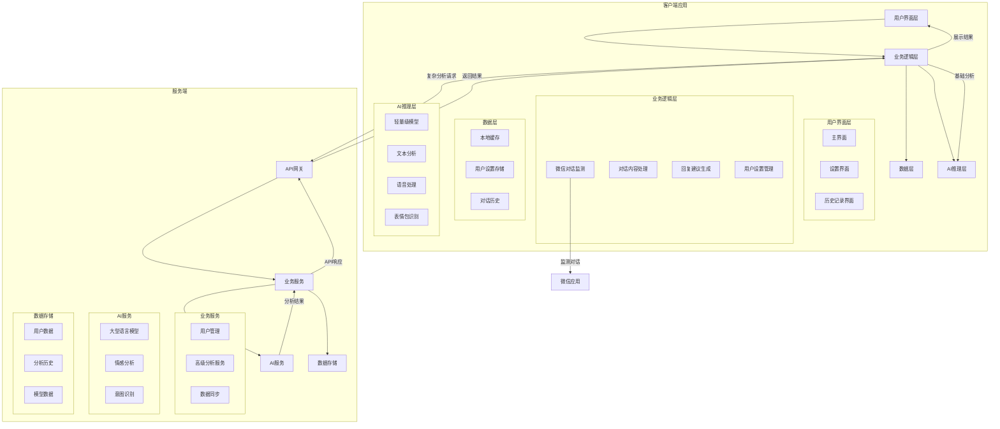

```mermaid
graph TD
    subgraph "客户端应用"
        A[用户界面层] --> B[业务逻辑层]
        B --> C[数据层]
        B --> D[AI推理层]
        
        subgraph "用户界面层"
            A1[主界面] 
            A2[设置界面]
            A3[历史记录界面]
        end
        
        subgraph "业务逻辑层"
            B1[微信对话监测]
            B2[对话内容处理]
            B3[回复建议生成]
            B4[用户设置管理]
        end
        
        subgraph "数据层"
            C1[本地缓存]
            C2[用户设置存储]
            C3[对话历史]
        end
        
        subgraph "AI推理层"
            D1[轻量级模型]
            D2[文本分析]
            D3[语音处理]
            D4[表情包识别]
        end
    end
    
    subgraph "服务端"
        E[API网关] --> F[业务服务]
        F --> G[AI服务]
        F --> H[数据存储]
        
        subgraph "业务服务"
            F1[用户管理]
            F2[高级分析服务]
            F3[数据同步]
        end
        
        subgraph "AI服务"
            G1[大型语言模型]
            G2[情感分析]
            G3[意图识别]
        end
        
        subgraph "数据存储"
            H1[用户数据]
            H2[分析历史]
            H3[模型数据]
        end
    end
    
    B1 --> |监测对话| 微信[微信应用]
    B --> |基础分析| D
    B --> |复杂分析请求| E
    G --> |分析结果| F
    F --> |API响应| E
    E --> |返回结果| B
    B --> |展示结果| A
```