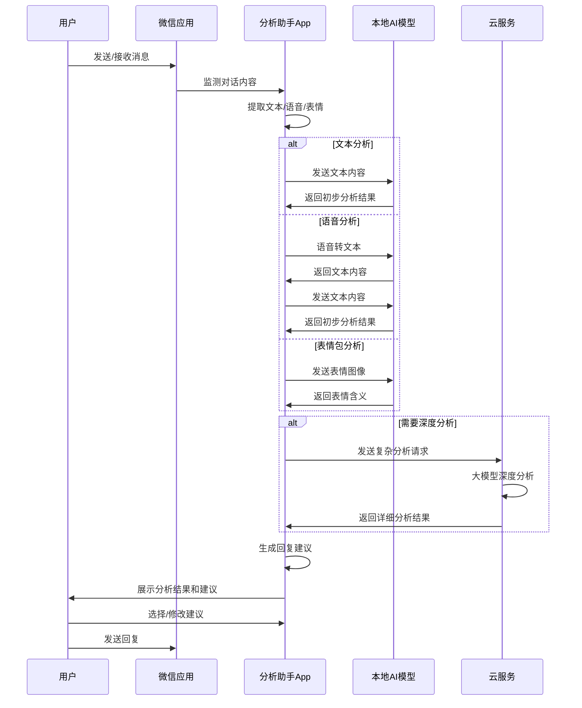

```mermaid
sequenceDiagram
    participant 用户
    participant 微信应用
    participant 分析助手App
    participant 本地AI模型
    participant 云服务
    
    用户->>微信应用: 发送/接收消息
    微信应用->>分析助手App: 监测对话内容
    分析助手App->>分析助手App: 提取文本/语音/表情
    
    alt 文本分析
        分析助手App->>本地AI模型: 发送文本内容
        本地AI模型->>分析助手App: 返回初步分析结果
    else 语音分析
        分析助手App->>本地AI模型: 语音转文本
        本地AI模型->>分析助手App: 返回文本内容
        分析助手App->>本地AI模型: 发送文本内容
        本地AI模型->>分析助手App: 返回初步分析结果
    else 表情包分析
        分析助手App->>本地AI模型: 发送表情图像
        本地AI模型->>分析助手App: 返回表情含义
    end
    
    alt 需要深度分析
        分析助手App->>云服务: 发送复杂分析请求
        云服务->>云服务: 大模型深度分析
        云服务->>分析助手App: 返回详细分析结果
    end
    
    分析助手App->>分析助手App: 生成回复建议
    分析助手App->>用户: 展示分析结果和建议
    用户->>分析助手App: 选择/修改建议
    用户->>微信应用: 发送回复
```