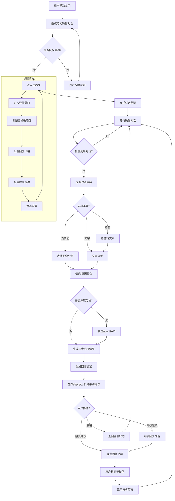

```mermaid
flowchart TD
    Start[用户启动应用] --> A[授权访问微信对话]
    A --> B{是否授权成功?}
    B -->|是| C[进入主界面]
    B -->|否| D[显示权限说明]
    D --> A
    
    C --> E[开启对话监测]
    E --> F[等待微信对话]
    
    F --> G{检测到新对话?}
    G -->|是| H[提取对话内容]
    G -->|否| F
    
    H --> I{内容类型?}
    I -->|文字| J[文本分析]
    I -->|语音| K[语音转文本]
    I -->|表情包| L[表情图像分析]
    
    K --> J
    L --> M[情感/意图提取]
    J --> M
    
    M --> N{需要深度分析?}
    N -->|是| O[发送至云端API]
    N -->|否| P[生成初步分析结果]
    
    O --> P
    
    P --> Q[生成回复建议]
    Q --> R[在界面展示分析结果和建议]
    
    R --> S{用户操作?}
    S -->|修改建议| T[编辑回复内容]
    S -->|接受建议| U[复制到剪贴板]
    S -->|忽略| V[返回监测状态]
    
    T --> U
    U --> W[用户粘贴至微信]
    V --> F
    
    W --> X[记录分析历史]
    X --> F
    
    subgraph "设置流程"
        AA[进入设置界面] --> BB[调整分析敏感度]
        BB --> CC[设置回复风格]
        CC --> DD[配置隐私选项]
        DD --> EE[保存设置]
        EE --> C
    end
    
    C --> AA
```