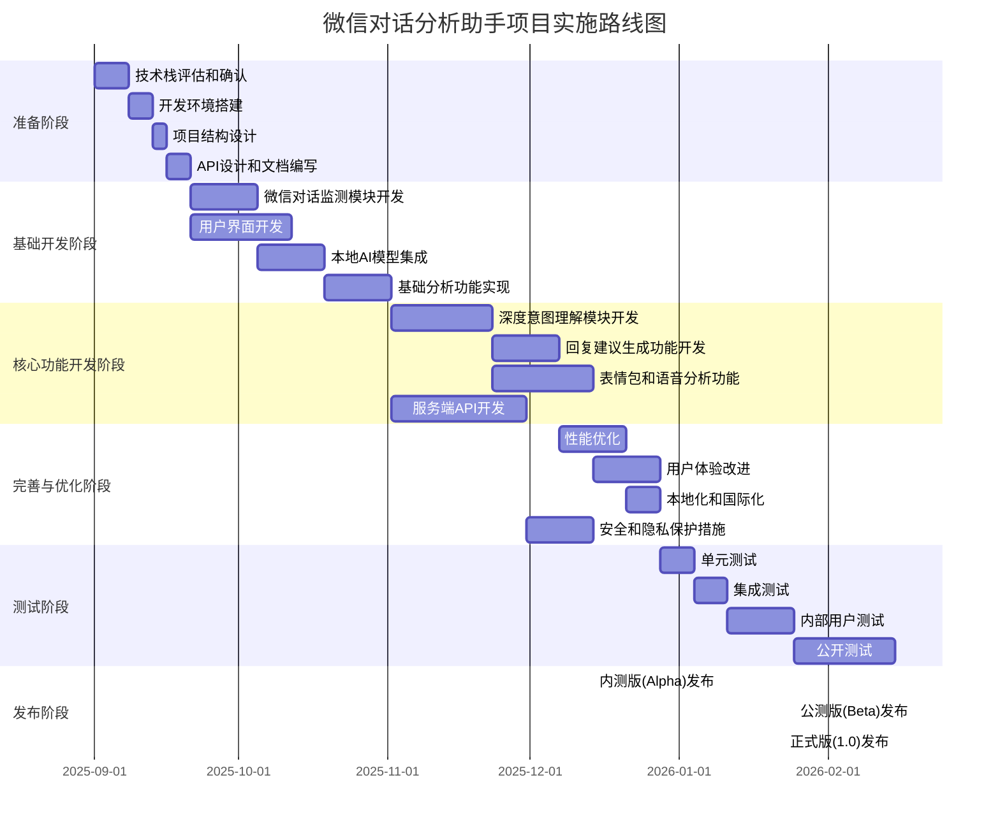

```mermaid
gantt
    title 微信对话分析助手项目实施路线图
    dateFormat  YYYY-MM-DD
    section 准备阶段
    技术栈评估和确认       :a1, 2025-09-01, 7d
    开发环境搭建           :a2, after a1, 5d
    项目结构设计           :a3, after a2, 3d
    API设计和文档编写      :a4, after a3, 5d
    
    section 基础开发阶段
    微信对话监测模块开发   :b1, after a4, 14d
    用户界面开发           :b2, after a4, 21d
    本地AI模型集成         :b3, after b1, 14d
    基础分析功能实现       :b4, after b3, 14d
    
    section 核心功能开发阶段
    深度意图理解模块开发   :c1, after b4, 21d
    回复建议生成功能开发   :c2, after c1, 14d
    表情包和语音分析功能   :c3, after c1, 21d
    服务端API开发          :c4, after b4, 28d
    
    section 完善与优化阶段
    性能优化               :d1, after c2, 14d
    用户体验改进           :d2, after c3, 14d
    本地化和国际化         :d3, after d1, 7d
    安全和隐私保护措施     :d4, after c4, 14d
    
    section 测试阶段
    单元测试               :e1, after d3, 7d
    集成测试               :e2, after e1, 7d
    内部用户测试           :e3, after e2, 14d
    公开测试               :e4, after e3, 21d
    
    section 发布阶段
    内测版(Alpha)发布      :f1, after d4, 0d
    公测版(Beta)发布       :f2, after e3, 0d
    正式版(1.0)发布        :f3, after e4, 0d
```